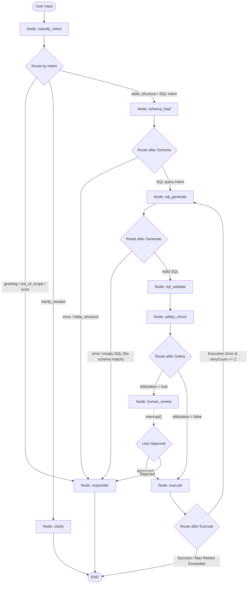

# PrepSQL LangGraph Agent Workflow & Architecture

This document describes the design, state management, and execution workflow of the PrepSQL Text-to-SQL agent. The agent is built using **LangGraph (JS)** and routes user requests dynamically based on intent, handles database schema introspection, validates generated queries, performs safety checks, handles human-in-the-loop approvals, and implements self-correcting error recovery.

---

## Agent Workflow Diagram

Below is the complete state graph flowchart illustrating node transitions, conditional routing decisions, and the human-in-the-loop boundary.



---

## Model & Architecture Settings

The agent utilizes **Groq API** with the **`llama-3.3-70b-versatile`** model for all natural language and SQL generation tasks, configured with a temperature of `0.0`/`0.1` and `maxRetries: 0` to prevent rate-limit loops.

---

## Node Descriptions & Responsibilities

### 1. `classify_intent` (Intent Classifier)
- **Model**: `llama-3.3-70b-versatile`
- **Output Mode**: Strict JSON Mode (`response_format: { type: "json_object" }`).
- **Role**: Uses ChatGroq to categorize the incoming user prompt. The returned JSON is parsed, validated against a hardcoded list of valid intents (`VALID_INTENTS`), and defaults to `clarify_needed` on failure.
- **Intents**:
  - `sql_retrieval`: Select queries without aggregation.
  - `sql_analytics`: Aggregate functions, group by, statistics.
  - `sql_modification`: INSERT, UPDATE, DELETE queries.
  - `sql_schema`: CREATE, ALTER, DROP queries.
  - `table_structure`: Explain table columns, keys, indexes.
  - `boolean_check`: Yes/no database-related questions.
  - `greeting`: Conversational greetings, small talk.
  - `clarify_needed`: Ambiguous database queries requiring further user detail.
  - `out_of_scope`: Non-database queries.

### 2. `schema_load` (Schema Introspector)
- **Role**: Automatically introspects the active database (SQLite, PostgreSQL, MySQL) schema and parses table and column data.
- **Caching**: Implements a 5-minute memory cache keyed by connection ID (`connectionId + dbDialect`) to avoid performance overhead. Invalidated automatically on any successful modification or schema-changing query.
- **Prompt Grounding**: Formats the schema details into a readable format for prompt injection during SQL generation.

### 3. `sql_generate` (SQL Generator)
- **Model**: `llama-3.3-70b-versatile` (Temperature: `0.1`, Max Tokens: `1024`)
- **Role**: Generates database-specific SQL queries (MySQL, Postgres, or SQLite) using few-shot prompts and system templates.
- **Schema Validation / Early Out**: If the user's request references tables/columns that do not exist, the LLM will not generate a SQL block. Instead, it generates a plain-English explanation list of the available tables.
- **Robust SQL Parsing**: Parses and selects the **LAST** generated SQL block using global regex matching to correctly handle comparisons (e.g., demonstrating the original query before generating a reversed query).

### 4. `sql_validate` (SQL Validator & Identifier Guard)
- **Role**: Standardizes identifiers, adds database-specific casing/quotes, and fixes syntax errors before executing.
- **Deterministic Validation**: Performs a lightweight, AST-free, regex-based check to parse CTE names, referenced tables, and qualified/unqualified columns in the SQL. It cross-references these against the database schema. If any unknown tables or columns are referenced (and the query is not a DDL table creation query), it sets the error state to trigger a retry (up to 2 times) or exits early with a detailed list of valid tables, preventing invalid queries from executing against the database.

### 5. `safety_check` (Regex Safety Guard)
- **Role**: Evaluates generated SQL strings using regex patterns to mark mutating commands (DELETE, UPDATE, DROP, ALTER, INSERT) to enforce safety rules.

### 6. `human_review` (Interrupt Gateway)
- **Role**: Pauses the LangGraph execution thread using `interrupt()` on mutation intents. Surrounds approval options inside the chat messages UI and resumes when approved or rejected by the user.

### 7. `execute` (Database Executor)
- **Role**: Establishes a connection to the active pool and runs queries.
- **Batch statement execution (SQLite)**: Utilizes `db.exec(sql)` for SQLite mutations rather than `db.run(sql)`. This allows running multiple sequential SQL statements in one payload (e.g. executing a `CREATE TABLE` immediately followed by multiple `INSERT INTO` records).
- **Self-Correction Retry Loop**: On SQL compilation or driver errors, it logs the error, increments `retryCount`, and loops back to `sql_generate` with the failure details to generate corrected SQL.
- **Conversation State**: Appends the final response `AIMessage` containing SQL, explanation, and a sample of database execution rows (up to 5 rows serialized as JSON) to `state.messages`, preserving conversational history for subsequent turns (e.g. "give insight based on answer").

### 8. `clarify` & `responder` (User Responders)
- **Role**: Format conversational texts for greetings, clarification questions, syntax errors, or cancellation confirmations. Appends the assistant responses to `state.messages` to preserve conversational memory.

---

## Dynamic System Prompt Construction

The SQL generator utilizes a dynamically constructed system prompt builder ([lib/agent/prompts/system.ts](file:///home/jainam/Documents/PrepSql/lib/agent/prompts/system.ts)) to adapt behavior based on the dialect, user intent, active connection, and permissions mode:

### System Prompt Structure

The template is compiled dynamically as follows:

```
You are an expert [dbDialect] SQL assistant.

## CRITICAL — Read This Before Anything Else

The ONLY tables and columns that exist are those listed in the "Database Schema" section at the bottom of this prompt.

Rules you MUST follow without exception:
1. If the user mentions a table that is NOT in the schema — do NOT generate SQL. Instead respond in plain English listing the available tables.
2. If the user mentions a column that is NOT in any schema table — do NOT generate SQL. Instead respond in plain English and show the correct columns for the relevant table.
3. Do NOT guess, rename, approximate, or invent table/column names. "users_data" is NOT the same as "users". Treat them as completely different.
4. Do NOT generate SQL for a table just because it sounds related or similar to one in the schema.
5. If you are even slightly unsure whether a table or column exists — check the schema section. If it is not there, it does not exist.
6. If the user asks to explain a query, analyze/discuss previous query execution results shown in the history, or ask for general insights about the schema/data (and is NOT requesting to execute a new query), do NOT generate SQL. Instead, respond in plain English with your analysis, explanation, or insights.

When a table or column is not found, your response must follow this exact format:
"The table/column '[name]' does not exist in your database.
Available tables are:
- table_one (col1, col2, col3)
- table_two (col1, col2)
..."

---

## Dialect Rules

[Dialect-Specific Hints]

---

## Query Mode

[Query Mode Permissions]

---

## Intent Guidance

[Intent Guidance]

---

## General Best Practices

- Always use JOINs when data from multiple tables is needed. Prefer explicit JOIN ... ON over implicit comma joins.
- Add ORDER BY for deterministic results.
- Use subqueries or CTEs when the logic becomes complex (WITH cte AS ...).
- Never use SELECT * in production queries — select only needed columns. However, if the user says "show all" or "show everything", SELECT * is fine.
- Use LIMIT to prevent accidental full-table scans unless the user asks for all rows.
- Consider foreign keys from the schema when joining tables.

---

## Output Format

When the query is valid and tables/columns exist:
1. Output EXACTLY ONE SQL code block: ```sql ... ```
2. Follow with a brief 1-3 sentence plain English explanation.
3. Do NOT add any preamble before the SQL block.
4. Do NOT output multiple SQL blocks or alternative queries.

When the table or column does not exist, or the user is requesting explanations/insights:
1. Do NOT output any SQL block at all — not even as an example.
2. Respond only in plain English as described in the CRITICAL section above.

---

## Database Schema

This is the ONLY source of truth. Nothing outside this section exists in the database.

[Grounded Schema Definition]

--- End of Schema ---

Remember: if a table or column is not listed above, it does not exist. Do not generate SQL for it.
```

---

## Agent State Shape (`AgentState`)

The graph carries a centralized, mutable state containing the following properties:

| Key | Type | Description |
|---|---|---|
| `messages` | `BaseMessage[]` | The LangChain message history list. |
| `userPrompt` | `string` | The latest raw input text from the user. |
| `threadId` | `string` | Unique session identifier mapped to LangGraph thread checkpointer. |
| `dbDialect` | `'sqlite' \| 'postgresql' \| 'mysql'` | Connected database dialect. |
| `connectionId` | `string` | Session connection identifier. |
| `schemaInfo` | `SchemaTable[] \| null` | Raw list of database tables, columns, and indexes. |
| `schemaFormatted`| `string` | Human-readable representation of schema injected into prompts. |
| `intent` | `IntentType` | Determined intent classification. |
| `generatedSQL` | `string` | The generated SQL query. |
| `explanation` | `string` | Assistant's text explanation of the query. |
| `isMutation` | `boolean` | Flag set to true if the query updates, inserts, or deletes records. |
| `mutationType` | `string` | The mutation action type (e.g. DELETE, UPDATE). |
| `humanApproved` | `boolean \| null` | Set to true upon user approval, false upon rejection, null if pending. |
| `executionResult`| `QueryResult \| null` | Column and row records returned from database execution. |
| `error` | `string \| null` | Any query generation or database runtime errors. |
| `retryCount` | `number` | Count of self-correction loops. |
| `finalResponse` | `Record<string, any>` | Formatted response payload sent back to the API. |

---

## Client-Driven Session Sync via LocalStorage

To allow developers to test isolated agent states and conversations independently of backend cookies or standard server session management, PrepSQL synchronizes session identifiers dynamically:
- **Client Storage**: The active session key (`prepsql-session-id`) is persisted in the browser's `localStorage`.
- **Fetch Interceptor**: Globally intercepts all outgoing `fetch()` requests in the frontend (`app/page.tsx`) to inject the session ID into the `x-prepsql-session-id` header.
- **Server Detection**: The backend (`lib/session.ts`'s `getSessionId()`) retrieves and adopts this header identifier immediately, allowing seamless end-to-end testing with distinct localStorage profiles.
