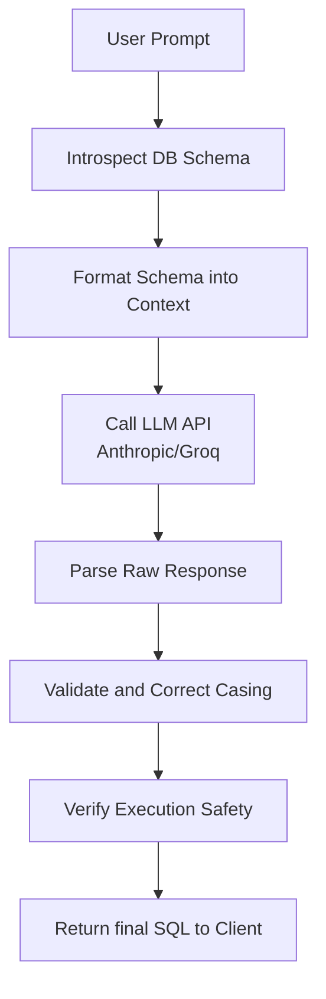

# PrepSQL Codebase Context & AI Integration Guide

PrepSQL is a modern Next.js web application designed to generate and execute SQL queries from natural language prompts using AI. It provides multi-database support (PostgreSQL, MySQL, MariaDB, SQLite) and incorporates schema introspection, safety checks, and an automated SQL validation layer to handle identifier casing issues.

---

## 1. Directory Structure

Here is an overview of the key directories and files in the codebase:

```text
├── app/
│   ├── api/
│   │   ├── connection/          # GET, POST, PATCH, DELETE database connections
│   │   ├── demo/                # Sets up a demo SQLite database in the session
│   │   ├── execute/             # Runs query execution against the connected DB
│   │   ├── generate/            # AI SQL generation, validation, and auto-correction
│   │   ├── history/             # Query history management (GET, DELETE)
│   │   └── mode/                # Retrieves/sets Query mode (readonly, crud, etc.)
│   ├── globals.css              # Main stylesheet (Tailwind CSS 4.0 configuration)
│   ├── layout.tsx               # Next.js Root Layout
│   └── page.tsx                 # Main application client component
├── components/
│   ├── AppHeader.tsx            # Header including user credentials & mode switches
│   ├── ConnectionForm.tsx       # Database credentials input form
│   ├── ConnectionsPage.tsx      # Database connection overview and selection UI
│   ├── HistorySidebar.tsx       # Sidebar containing executed queries history
│   ├── QueryInterface.tsx       # SQL editor, instructions input, and output table
│   ├── ResultsTable.tsx         # Display for query execution results (with CSV export)
│   ├── SQLEditor.tsx            # Custom SQL editor for previewing generated queries
│   └── SchemaSidebar.tsx        # Side panel showing introspected schema tables/columns
├── lib/
│   ├── api-key-storage.ts       # Utility to sync LLM API keys with server cookies
│   ├── claude.ts                # Main AI integration (System prompts, Groq/Anthropic APIs)
│   ├── client-connection.ts     # Client-side helper for credentials and reconnecting
│   ├── connection-defaults.ts   # Port defaults, localStorage keys, and saved connection loaders
│   ├── database.ts              # Connection pools manager for PostgreSQL, MySQL, SQLite
│   ├── pg-identifiers.ts        # Helper to double-quote PostgreSQL identifiers
│   ├── schema-format.ts         # Introspected schema formatter for system prompts
│   ├── schema.ts                # Database introspector for all supported dialects
│   ├── session.ts               # Server sessions Manager for connection configs and api keys
│   ├── sql-validator.ts         # Post-generation casing corrector and PostgreSQL identifier quoter
│   ├── sqlite-adapter.ts        # Sync-to-Async adapter wrapper for Node.js native DatabaseSync
│   └── types.ts                 # TypeScript type declarations
```

---

## 2. Core Database Operations

The application leverages distinct drivers to connect to and introspect client databases:
* **PostgreSQL**: Handled using the `pg` Pool client.
* **MySQL/MariaDB**: Handled using the `mysql2/promise` client.
* **SQLite**: Uses the built-in `node:sqlite` module (specifically `DatabaseSync` in newer Node versions). The `lib/sqlite-adapter.ts` file adapts the synchronous `DatabaseSync` APIs into asynchronous, callback-based signatures compatible with standard query execution models.

All connection pools are cached in-memory and mapped by their connection details inside [lib/database.ts](file:///home/jainam/Documents/PrepSql/lib/database.ts) to minimize handshake latency.

---

## 3. AI SQL Generation & Validation Pipeline

The SQL generation process goes through a five-stage pipeline to ensure that the generated SQL conforms to the exact database schema, handles casing differences, and enforces query safety.



### Stage 1: Live Introspection (`lib/schema.ts`)
When a generation request starts, the backend executes schema queries tailored to the active database dialect to map out all tables, columns, types, primary keys, foreign keys, and indexes:
* **PostgreSQL**: Queries are run against `pg_catalog.pg_class`, `pg_catalog.pg_attribute`, and `pg_catalog.pg_constraint` rather than `information_schema`. This ensures that **original casing** (e.g. `userId` or `createdAt` in camelCase/mixedCase) is preserved, as `information_schema` normalizes all identifier names to lowercase.
* **SQLite**: Queries use `PRAGMA table_info`, `PRAGMA foreign_key_list`, and `PRAGMA index_list`.
* **MySQL**: Queries use `information_schema.COLUMNS` and `information_schema.KEY_COLUMN_USAGE`.

### Stage 2: Schema Formatting (`lib/schema-format.ts`)
The introspected schema metadata is formatted into a clear, structured text representation.
* For **PostgreSQL**, every table and column name is pre-wrapped in double-quotes (e.g. `Table "Users"` and `- "userId" (varchar)`).
* Crucially, a mandatory PostgreSQL warning is appended instructing the AI model to copy all identifiers **verbatim** including the double-quotes to prevent PostgreSQL runtime errors caused by automatic lowercasing.

### Stage 3: LLM Invocation & Parsing (`lib/claude.ts`)
The system prompt is dynamically assembled combining database metadata, query mode rules (e.g., `readonly` disallows mutations; `schema` allows DDL), and the schema context:
* The user prompt is sent to either **Anthropic (Claude 3.5 Sonnet)** or **Groq (Llama 3.1 8B)**.
* The model output is parsed to extract the SQL query block (delimited by ` ```sql `) and the explanation.

### Stage 4: Post-Generation Casing Correction (`lib/sql-validator.ts`)
Even with strong prompting rules, LLMs sometimes lowercase mixed-cased columns or omit double-quotes. PrepSQL runs a custom tokenizer that parses the SQL string:
1. It ignores string literals (`'...'`), already double-quoted regions (`"..."`), backticks (`` `...` ``), and positional parameters (`$1`).
2. Bare identifiers are extracted and matched case-insensitively against the real schema.
3. If there is a casing mismatch, it automatically replaces the identifier with the exact casing from the schema.
4. For PostgreSQL, if a bare identifier is identified as a schema table or column, it is automatically wrapped in double-quotes.

### Stage 5: Execution Safety Check (`lib/claude.ts`)
Before returning the final SQL to the client, the backend analyzes the queries to flag mutations (e.g. `DROP`, `TRUNCATE`, `DELETE`, `UPDATE`, `INSERT`, `ALTER`). If a mutation is detected, it is marked as `isMutation: true` and surfaced in the client. Depending on the connection mode settings, client-side safety warnings are displayed to prompt the user before execution.

---

## 4. Main API Endpoints

### `POST /api/generate`
Generates an SQL query based on the user's natural language request.
* **Payload**:
  ```json
  { "prompt": "Show me the top 3 products ordered by price" }
  ```
* **Response**:
  ```json
  {
    "sql": "SELECT * FROM products ORDER BY price DESC LIMIT 3",
    "explanation": "Retrieves the highest-priced products by sorting price in descending order and limiting to 3 rows.",
    "usage": { "promptTokens": 512, "completionTokens": 96 },
    "safetyOk": true,
    "isMutation": false,
    "identifierCorrections": [],
    "unmatchedIdentifiers": []
  }
  ```

### `POST /api/execute`
Executes an SQL query against the active database.
* **Payload**:
  ```json
  { "sql": "SELECT * FROM products ORDER BY price DESC LIMIT 3" }
  ```
* **Response**:
  ```json
  {
    "columns": ["id", "name", "price", "stock", "category"],
    "rows": [
      { "id": 2, "name": "Mechanical Keyboard", "price": 89.99, "stock": 80, "category": "Electronics" },
      { "id": 1, "name": "Wireless Mouse", "price": 29.99, "stock": 150, "category": "Electronics" },
      { "id": 3, "name": "USB-C Hub", "price": 19.99, "stock": 200, "category": "Electronics" }
    ],
    "rowCount": 3
  }
  ```
