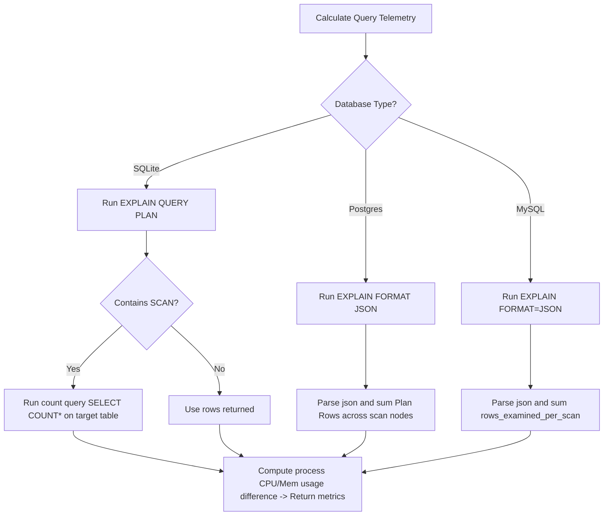
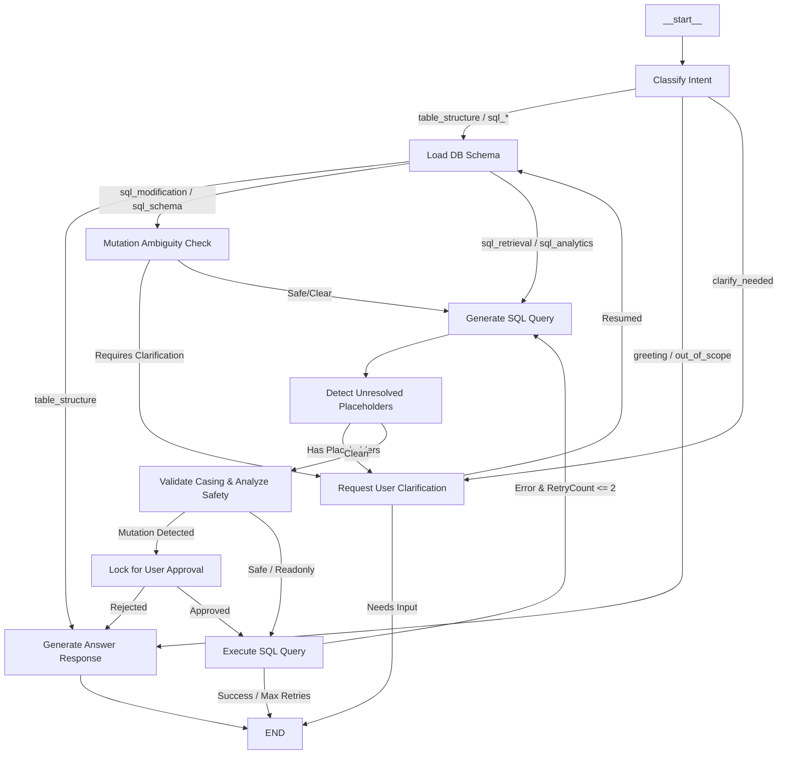

# PrepSQL - Complete Technical System Documentation & Architecture Guide

Welcome to the PrepSQL technical system documentation. This document is designed for the development team to understand the system architecture, file structure, database interfaces, AI pipelines, API endpoints, and design system of PrepSQL.

---

## 1. System Overview & Key Features

PrepSQL is a modern, responsive developer-tool web application designed to bridge the gap between natural language prompts and database queries. It uses the free API of Groq (Llama 3.3 70B) for the proof of concept (POC) to generate, validate, optimize, and execute SQL statements against local and remote databases.

Key capabilities include:

- **AI-Powered SQL Generation & Optimization**: A multi-stage AI validation agent built with LangGraph that handles query refinements, fixes casing errors, and provides natural language explanations.
- **Dialect-Agnostic Database Support**: Direct drivers support PostgreSQL, MySQL, MariaDB, and SQLite (local or remote/Turso integration).
- **Execution Telemetry**: Evaluates query efficiency using native execution plan commands (`EXPLAIN`) and reads process-level hardware usage (CPU and memory consumption) for local instances.
- **Query Safety Guardrails**: Built-in safety warnings and execution locks for potentially destructive DDL or DML mutations (e.g. `DROP`, `TRUNCATE`, `DELETE` without `WHERE`).
- **Session-Based Isolation**: Client connections are isolated via a session-based cookie identifier. Sensitive credentials like database passwords and API keys can be saved in local environment files or encrypted in cookie sessions (not persisted permanently in shared cloud stores).

---

## 2. Core Technology Stack

- **Frontend Framework**: [React 19](https://react.dev/) & [Next.js 16 (App Router)](https://nextjs.org/)
- **State Management & Queries**: [@tanstack/react-query](https://tanstack.com/query/latest) for client-side API caching and synchronization.
- **Data Grid rendering**: [@tanstack/react-table](https://tanstack.com/table) (v8) for high-performance sorting, filtering, and pagination.
- **AI Orchestration**: [@langchain/core](https://js.langchain.com/) and [@langchain/langgraph](https://langchain-ai.github.io/langgraphjs/) for conversational memory and execution graph routing.
- **Database Drivers**:
  - `pg` for PostgreSQL pools.
  - `mysql2` for MySQL/MariaDB promises pools.
  - `node:sqlite` (DatabaseSync API in Node.js) wrapped with a custom async adapter.
- **Persistence Layer**: [MongoDB](https://www.mongodb.com/) (using native driver `mongodb`) for session settings, query execution logs, analytics audits, and connection preferences.
- **Styling**: [Tailwind CSS 4.0](https://tailwindcss.com/) paired with custom glassmorphism parameters and modern Google Fonts (**Geist Sans** and **Geist Mono** pairings).
- **Visualizations**: [Recharts](https://recharts.org/) for live latency histograms, schema health donuts, and table execution indexes.

---

## 3. Directory & File Structure

```text
├── app/
│   ├── api/                     # Serverless Next.js API Routes
│   │   ├── analysis/            # Handles SQL efficiency analytics and health audits
│   │   ├── analyze/             # Runs telemetry explain analyzers on target queries
│   │   ├── chat/                # Feeds conversation logs to LangGraph
│   │   ├── connection/          # Manages server-side database connections
│   │   ├── demo/                # Provisions mock SQLite databases for sandboxed trials
│   │   ├── execute/             # Direct raw/AI-generated SQL query executor
│   │   ├── generate/            # Standard AI generator entry point
│   │   ├── history/             # Query logs tracker
│   │   ├── mode/                # Configuration settings for query safety modes
│   │   ├── preferences/         # User visual settings configurations
│   │   ├── saved-connection/    # Syncs client connection templates
│   │   ├── schema/              # Dialect schema introspection endpoints
│   │   └── settings/            # Cookie API key synchronization endpoint
│   ├── globals.css              # Glassmorphic Tailwind CSS definitions
│   ├── layout.tsx               # Primary application wrapper & viewport setup
│   ├── page.tsx                 # Main application workspace layout
│   └── providers.tsx            # Context boundaries (React Query, theme states)
├── components/
│   ├── AnalyticsPage.tsx        # Charts panel featuring query telemetry dashboards
│   ├── ApiKeySetup.tsx          # Card prompt displayed when LLM keys are absent
│   ├── AppHeader.tsx            # Header rendering connection state and user profiles
│   ├── ConnectionForm.tsx       # Standard inputs to initiate DB pool handshakes
│   ├── ConnectionsPage.tsx      # Carousel list of connections displaying latency sparklines
│   ├── NavigationSidebar.tsx    # Left-hand Framer-styled core app views navigation
│   ├── QueryInterface.tsx       # Editor inputs, prompt inputs, and execution logs
│   ├── ResultsTable.tsx         # Data grid rendering results and CSV exporters
│   ├── SQLEditor.tsx            # Snippet highlight display for generated queries
│   ├── SchemaEditor.tsx         # Graphic interface to draft, edit, and delete columns
│   ├── SchemaSidebar.tsx        # Tabbed panel exposing indexes, history, and schema trees
│   ├── SettingsModal.tsx        # Form configured to update Groq API Keys
│   └── Toast.tsx                # Contextual warning, alert, and success notifications
├── lib/
│   ├── agent/                   # LangGraph state machine & AI agent nodes
│   │   ├── nodes/               # Step executors (intent, schema loading, safety)
│   │   ├── prompts/             # System templates & few-shot query examples
│   │   ├── graph.ts             # State transitions and route controllers
│   │   ├── index.ts             # Core agent invocation interface
│   │   ├── memory.ts            # LangGraph checkpointer initialization
│   │   └── state.ts             # TypeScript shapes for agent memory states
│   ├── api-key-storage.ts       # LLM API keys cookies synchronizer
│   ├── app-state.ts             # Client Session manager and password stripping helper
│   ├── claude.ts                # Raw Groq invocation wrappers
│   ├── client-connection.ts     # Client side browser loaders
│   ├── connection-defaults.ts   # Port defaults and schema variables
│   ├── database.ts              # Connection pools cache manager for SQL databases
│   ├── db.ts                    # MongoDB data access routines (query history, audit states)
│   ├── demo-db.ts               # Provisions local test schemas for sandbox use
│   ├── history-classify.ts      # Classifies query types (SELECT, UPDATE, CREATE) from SQL verbs
│   ├── mongodb.ts               # Shared MongoDB database connection singleton
│   ├── null-check.ts            # Inspects NULL values prior to DDL NOT NULL migrations
│   ├── pg-identifiers.ts        # Double quotes checker for Postgres identifiers
│   ├── schema-format.ts         # Assembles DB schemas into system prompts
│   ├── schema.ts                # Dialect-specific database schema introspector
│   ├── sql-validator.ts         # Casing corrector & auto double-quoter for identifiers
│   ├── sqlite-adapter.ts        # Sync-to-Async sqlite adapter wrapper
│   ├── telemetry.ts             # EXPLAIN plan analyzers and CPU/Memory calculators
│   ├── types.ts                 # Project type definitions
│   └── utils.ts                 # Classname merges (clsx, tailwind-merge)
```

---

## 4. Database Introspection, Execution & Telemetry Engine

To ensure AI generations remain aligned with the target schema and operate with low execution costs, PrepSQL implements custom database introspectors and planners.

### A. Scheme Introspection (`lib/schema.ts`)

Standard introspectors using typical `information_schema` schemas convert identifiers into lowercase. PrepSQL implements dialect-specific strategies:

1. **PostgreSQL**: Queries are run against system tables (`pg_catalog.pg_class`, `pg_catalog.pg_attribute`, `pg_catalog.pg_constraint`) rather than `information_schema`. This ensures that **original casing** (e.g. `userId` or `createdAt` in camelCase/mixedCase) is preserved, avoiding runtime exceptions caused by PostgreSQL's default lowercase resolution.
2. **MySQL / MariaDB**: Performs targeted queries against `information_schema.COLUMNS` and `information_schema.KEY_COLUMN_USAGE` to determine keys, index coverages, and column characteristics.
3. **SQLite**: Employs sequential `PRAGMA table_info`, `PRAGMA foreign_key_list`, and `PRAGMA index_list` calls to construct table configurations.

### B. Sync-to-Async SQLite Adapter (`lib/sqlite-adapter.ts`)

Because Node.js's native `DatabaseSync` functions are synchronous, passing them directly to asynchronous server controllers could block the main event loop. `sqlite-adapter.ts` wraps the synchronous API inside callback structures:

```typescript
// Example pattern wrapping sync SQLite calls into Promise contracts
export class SQLiteAdapter {
  private db: any; // Node.js DatabaseSync instance
  constructor(filepath: string) {
    this.db = new DatabaseSync(filepath);
  }
  public async get(sql: string, params: any[] = []): Promise<any> {
    return new Promise((resolve, reject) => {
      try {
        const stmt = this.db.prepare(sql);
        const result = stmt.get(...params);
        resolve(result);
      } catch (err) {
        reject(err);
      }
    });
  }
}
```

### C. EXPLAIN Query Planning & Analytics Telemetry (`lib/telemetry.ts`)

For `SELECT` queries, PrepSQL executes a silent `EXPLAIN` query prior to showing execution stats. This returns exact index usage and scanned rows count.



- **SQLite**: Runs `EXPLAIN QUERY PLAN <sql>`. If it identifies a full table scan (`SCAN TABLE`), it performs a background row count (`SELECT COUNT(*)`) on that specific table to find the exact count of scanned records.
- **PostgreSQL**: Invokes `EXPLAIN (FORMAT JSON) <sql>`. The telemetry parser recursively traverses the tree to sum the estimated row reads (`Plan Rows`) from scan nodes (`Seq Scan`, `Index Scan`, etc.).
- **MySQL / MariaDB**: Runs `EXPLAIN FORMAT=JSON <sql>`. The utility parses the JSON response and sums all occurrences of the `rows_examined_per_scan` property.
- **Resource Monitoring**:
  - **Local SQLite**: Real-time process benchmarks are tracked using Node's hooks (`process.cpuUsage()` and `process.memoryUsage()`) before and after query resolution.
  - **Remote DBs**: To avoid skewing results with connection overhead, CPU and memory load are estimated client-side using row density calculations and local network latencies.

---

## 5. MongoDB Data Access Layer & Session Management

To ensure isolated multi-tenant execution contexts, PrepSQL implements browser session partitioning.

### A. Client Session Identification (`lib/app-state.ts`)

A unique `clientId` (stored in an HTTP-only cookie `prepsql-client`) is automatically assigned to every client browser. All entries saved in MongoDB are mapped to this `clientId` (which acts as the `sessionId`).

Sensitive operations (such as loading database connections) fetch credentials by keying on this cookie:

```typescript
export async function getClientId(): Promise<string> {
  const headerStore = await headers();
  const headerClientId = headerStore.get("x-prepsql-client-id");
  if (headerClientId) return headerClientId;

  const cookieStore = await cookies();
  let clientId = cookieStore.get("prepsql-client")?.value;
  if (!clientId) {
    clientId = randomBytes(16).toString("hex");
    cookieStore.set("prepsql-client", clientId, {
      httpOnly: true,
      secure: process.env.NODE_ENV === "production",
      sameSite: "lax",
      path: "/",
      maxAge: 60 * 60 * 24 * 7, // 1 week duration
    });
  }
  return clientId;
}
```

### B. Core Collections Schema & Indexes (`lib/db.ts`)

The application creates indexes during database initialization to optimize telemetry dashboard loading:

- **`query_history`**: Indexes `{ sessionId: 1, timestamp: -1 }` to display recent execution list tables.
- **`analysis_results`**: Indexes `{ sessionId: 1, createdAt: -1 }` for caching connection audit history logs.
- **`chat_messages`**: Unique index `{ connectionId: 1 }` to isolate chat history threads between database instances.
- **`app_settings`**: Index `{ sessionId: 1, key: 1 }` to preserve UI mode states.
- **`sessions`**: Index `{ sessionId: 1 }` to manage transaction logs.

### C. Security Practices

- **Password Scrubbing**: When database connection configurations are passed to client scopes, `stripPassword` intercepts objects to remove password entries.
- **Credential Storage**: Connection configurations are stored in MongoDB. However, credentials can also be set strictly in local `.env.local` files (e.g. `GROQ_API_KEY`), which will override database entries.

---

## 6. AI SQL Generation & Intent Routing Pipeline (LangGraph)

The AI engine uses LangGraph to classify user prompts, retrieve schemas, execute checks, correct errors, and format responses.

### A. Intent Classification (`lib/agent/nodes/intent.ts`)

All prompts are classified by an initial parser model (using the free API of Groq with `llama-3.3-70b-versatile` for the POC) into one of the following categories:

- `sql_retrieval`: Basic read operations (`SELECT` without aggregations).
- `sql_analytics`: Complex read operations featuring `GROUP BY`, aggregation functions, windowing, etc.
- `sql_modification`: Data-manipulation queries (`INSERT`, `UPDATE`, `DELETE`).
- `sql_schema`: Data-definition queries (`CREATE`, `ALTER`, `DROP`).
- `table_structure`: Queries seeking schema overviews rather than execution commands.
- `clarify_needed`: Prompts containing ambiguous terms (e.g., "Find the latest entries" without specifying columns or tables).
- `greeting`/`out_of_scope`: General small talk or queries unrelated to SQL.

### B. Workflow Graph Architecture (`lib/agent/graph.ts`)



### C. Post-Generation Casing Correction (`lib/sql-validator.ts`)

Even when structured prompts are used, LLM engines sometimes alter identifier casings (e.g., lowercasing camelCase fields) or omit double quotes in PostgreSQL. PrepSQL handles this with a SQL validation tokenizer:

1. Splits the generated SQL into tokens, ignoring string literals (`'...'`), already double-quoted regions (`"..."`), backticks (`` `...` ``), and positional parameters (`$1`).
2. Extracts bare identifiers and performs a case-insensitive lookup against the active database schema.
3. If a casing mismatch is identified, it replaces the query token with the exact case representation from the database.
4. For **PostgreSQL**, if the bare token corresponds to an introspected table or column, it wraps the token in double quotes (e.g., `userId` becomes `"userId"`).

---

## 7. Main API Endpoints Reference

### Connection Endpoints

#### `GET /api/connection`

- **Description**: Returns the active connection database type and credential configurations (passwords are stripped).
- **Response**:
  ```json
  {
    "id": "a9f8b7c6",
    "type": "postgresql",
    "name": "Production Read Replica",
    "host": "postgres.db.local",
    "port": 5432,
    "user": "read_only_user",
    "database": "analytics_dw"
  }
  ```

#### `POST /api/connection`

- **Description**: Verifies and establishes a connection pool cache, and saves the connection configuration to MongoDB.
- **Payload**:
  ```json
  {
    "type": "mysql",
    "name": "MySQL Connection",
    "host": "localhost",
    "port": 3306,
    "user": "root",
    "password": "securepassword",
    "database": "sales_db"
  }
  ```

---

### Core Query Endpoints

#### `POST /api/generate`

- **Description**: Accepts a natural language prompt and generates an SQL query.
- **Payload**:
  ```json
  {
    "prompt": "Show sales metrics grouped by region for 2026"
  }
  ```
- **Response**:
  ```json
  {
    "sql": "SELECT region, SUM(sales_amount) FROM sales WHERE year = 2026 GROUP BY region",
    "explanation": "Computes aggregate sum of sales grouped by the region column for records in the year 2026.",
    "usage": { "promptTokens": 768, "completionTokens": 142 },
    "isMutation": false
  }
  ```

#### `POST /api/execute`

- **Description**: Executes raw or generated SQL against the active connection.
- **Payload**:
  ```json
  {
    "sql": "SELECT region, SUM(sales_amount) FROM sales GROUP BY region"
  }
  ```
- **Response**:
  ```json
  {
    "columns": ["region", "SUM(sales_amount)"],
    "rows": [
      { "region": "EMEA", "SUM(sales_amount)": 450000.5 },
      { "region": "APAC", "SUM(sales_amount)": 620000.75 }
    ],
    "rowCount": 2
  }
  ```

---

### History & Auditing Endpoints

#### `GET /api/history`

- **Description**: Fetches execution logs for the current session. Supports optional connection filtering.
- **Query Parameters**:
  - `connectionId` (Optional): Restricts results to a single connection.
  - `limit` (Optional): Page limit. Defaults to 500.
- **Response**:
  ```json
  {
    "items": [
      {
        "id": "603d21fd",
        "prompt": "Show region metrics",
        "sql": "SELECT region, SUM(sales_amount) FROM sales GROUP BY region",
        "timestamp": 1782729900000,
        "success": true,
        "executionTime": 14,
        "rowsScanned": 1500,
        "rowsReturned": 2,
        "cpuUsage": 4,
        "memoryUsage": 8,
        "indexesUsed": []
      }
    ],
    "total": 1
  }
  ```

---

## 8. UI Theme & Design System

PrepSQL features a modern developer-focused interface styled around the **"Blue Aurora Glassmorphism"** theme:

- **Color Palette & Backdrop**:
  - Main background is a cool off-white base (`#F9FAFB`).
  - Styled with soft background blur elements (soft blue `#93C5FD`/35%, ice cyan `#A5F3FC`/28%, and lavender `#C4B5F4`/22%) set to `blur-[100px]` to `blur-[130px]`.
- **Glassmorphic Panels**:
  - Styled with a semi-translucent background (`rgba(255, 255, 255, 0.60)`) and `backdrop-filter: blur(20px)`.
  - Floating menus and dropdowns use an opaque white background (`rgba(255, 255, 255, 0.95)`) to prevent overlapping text from showing through.
  - Finished with clean borders (`rgba(255, 255, 255, 0.80)`) and a soft shadow effect (`0 4px 24px rgba(59, 130, 246, 0.08)`).
- **Typography Pairing**:
  - Core UI text uses **Geist Sans** (with **Inter** fallback) for high information density.
  - SQL code blocks use **Geist Mono** (with **JetBrains Mono** / **Fira Code** fallback) for layout alignment.
- **Integrated User Profile Dropdown**:
  - Features a click-outside-aware avatar menu in the header with two settings:
    1. **Profile**: Triggers the configuration modal for API keys.
    2. **Sign Out**: Clears connection sessions and redirects back to the entry page.
- **Nested Query Execution Lifecycle Explorer**:
  - The query execution lifecycle timeline is embedded directly inside the **Recent Executions** component rather than launching in a separate view.
  - Clicking a row replaces the list table with the detailed lifecycle timeline explorer, complete with an inline breadcrumb (`Recent Executions / Query #<id> Lifecycle`) and an explicit back button.

---

## 9. Operations & Setup Checklist

### A. Environment Configuration

Create a `.env.local` file in the root directory:

```bash
# Set MongoDB connection string
MONGODB_URI=mongodb://localhost:27017/prepsql

# Specify LLM API Key (Groq)
GROQ_API_KEY=gsk_xxx...

# Encryption secret key (auto-generated if left empty)
ENCRYPTION_KEY=your-32-byte-hexadecimal-key
```

### B. Local Database Setup (For Development testing)

#### PostgreSQL

Start the PostgreSQL server locally:

```bash
# macOS
brew services start postgresql

# Linux (Systemd)
sudo systemctl start postgresql
```

Ensure a target test database exists:

```bash
psql -U postgres -c "CREATE DATABASE prepsql_dev_db;"
```

#### MySQL / MariaDB

Start the service:

```bash
# macOS
brew services start mysql

# Linux
sudo systemctl start mysql
```

### C. Build and Run Commands

Ensure you use `pnpm` to install packages and manage build pipelines:

```bash
# Install package dependencies
pnpm install

# Run the next dev local server
pnpm dev

# Perform TS verification checks
pnpm type-check

# Compile production build
pnpm build

# Start production server
pnpm start
```
