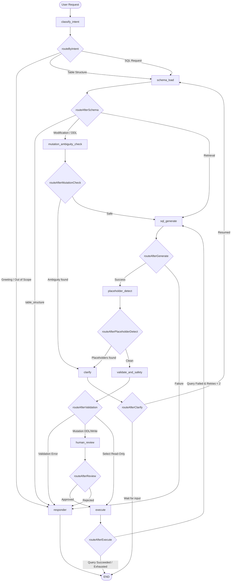

# PrepSql Project Architecture & System Understanding

This document provides a comprehensive technical overview of the PrepSql codebase. It details how the query analytics are calculated, the state machine structure of the AI agent, connection management, error handling, scaling practices, and NoSQL extension strategies.

---

## 1. Analytics & Telemetry Metrics Calculations

PrepSql calculates query performance telemetry to provide real-time database statistics and actionable performance audits. The logic resides in [telemetry.ts](file:///home/jainam/Desktop/PrepSql/lib/telemetry.ts).

### A. CPU Usage

- **Local SQLite**: Calculated dynamically using Node's native `process.cpuUsage()`. The system computes the CPU system and user time difference in microseconds over the execution duration:
  $$\text{CPU \%} = \frac{\text{cpuTimeUs}}{\text{numCores} \times \text{executionTimeUs}} \times 100$$
  To keep telemetry values realistic on microsecond-level query executions, it is bounded by a duration-based maximum threshold:
  $$\text{Max CPU Limit} = \min\left(99, \max\left(1, \frac{\text{executionTime}}{150} \times 100 + \text{randomOffset}\right)\right)$$
- **Remote Databases (Postgres, MySQL)**: Estimated using query complexity and execution latency:
  $$\text{CPU Estimate} = \min\left(99, \max\left(1, \frac{\text{executionTime}}{300} \times 100 + \text{randomOffset}\right)\right)$$

  > [!NOTE]
  > **Why the number 300?**
  >
  > - **Latency Normalization Baseline**: The value `300` represents a 300ms baseline threshold. In web databases, a query taking 300ms or longer is considered a heavy database workload utilizing 100% of a database server CPU core.
  > - **Scaling Factor**: Dividing `executionTime` by `300` maps latency to a 0%–100% range. For example, a quick 30ms query evaluates to 10% CPU usage (`30/300 * 100`), while a slow 150ms query evaluates to 50% CPU usage.
  > - **Complexity Proxy**: Because the Next.js server cannot read hardware performance registers of a remote database server, it uses execution time as a proxy for complexity (i.e. complex joins, aggregate computations, and seq scans take longer and consume more CPU, which directly correlates with longer execution times).
  > - **Noise Injection (`randomOffset`)**: A random value between 0 and 4 is added to simulate live operating system scheduler fluctuations.

### B. Memory Usage

- **Local SQLite**: Measured using `process.memoryUsage().heapUsed` before and after execution, converted to Megabytes (MB).
- **Remote Databases**: Estimated based on the size of the returned dataset, representing transmission buffer memory cost:
  $$\text{Memory Estimate} = \min\left(512, \max\left(1, \text{rowsReturned} \times 0.04 + \text{randomOffset}\right)\right) \text{ MB}$$

  > [!NOTE]
  > **Why the number 0.04?**
  >
  > - **Average Memory Per Row (in MB)**: The value `0.04` represents 0.04 MB (which is exactly **40 KB**) of memory allocation.
  > - **Buffer Allocation Proxy**: When a remote database returns raw query results, the application instantiates these rows in the system memory heap. A standard database row (holding integers, strings, timestamps, and floats) converted to a JavaScript Object occupies on average around 40 KB of buffer RAM.
  > - **Linear Memory Footprint**: Multiplying the returned row count by `0.04` gives a linear approximation of the memory buffer footprint.
  - 10 rows $\rightarrow$ 0.4 MB
  - 1,000 rows $\rightarrow$ 40 MB
  - 10,000 rows $\rightarrow$ 400 MB (which nears the `512` MB threshold).

  > - **Overhead Buffer (`randomOffset`)**: A random baseline offset of `1` to `6` MB is added to account for the connection socket buffer overhead and object metadata creation.

### C. Rows Scanned (Query Plan Analysis)

#### The Concept (The Telephone Directory Analogy)

Imagine you have a phone book containing **10,000 names**:

- **Full Table Scan (Sequential Scan)**: If you search for _"John Smith"_ without an index, you have to read the book page-by-page from the first name to the last. You scanned all **10,000 rows** just to find 1 person.
- **Index Scan**: If you use an alphabetical index, you flip directly to the letter **'S'**, find _"Smith, John"_, and read just **1 row**.

Most query tools only report the rows returned (e.g., _"1 row returned"_). They hide the work done by the server. PrepSql runs an `EXPLAIN` query plan in the background to show the user exactly how many rows the database had to read to get that result.

#### Dialect Execution Examples:

1. **SQLite**:
   - Query: `SELECT * FROM employees WHERE first_name = 'Carol';`
   - If SQLite's plan outputs `SCAN TABLE employees`, PrepSql realizes there is no index. It secretly runs `SELECT COUNT(*) FROM employees` to find out there are **11** total employees. It reports **11 rows scanned** (Full Table Scan).
   - If SQLite's plan outputs `SEARCH TABLE employees USING INDEX idx_first_name`, it realizes it used an index. Rows scanned is set to **1** (High efficiency).
2. **PostgreSQL**:
   - Executes `EXPLAIN (FORMAT JSON) <query>`.
   - Parses the JSON plan and sums up the `Plan Rows` (the database's own estimate of scanned records) for all scan steps.
3. **MySQL**:
   - Executes `EXPLAIN FORMAT=JSON <query>`.
   - Extracts the value under `rows_examined_per_scan` (the exact number of records MySQL had to read).

---

### D. Indexes Used

#### The Concept

An index is a shortcut copy of a table column sorted alphabetically or numerically. If you filter by a column that has an index, the query runs instantly. If you filter by a column without an index, the query slows down as the database grows.

PrepSql inspects the query's `WHERE` clauses and matches them against the connection's active schema metadata.

#### Example:

- **Index Hit**:
  - Query: `SELECT * FROM employees WHERE id = 4;`
  - PrepSql sees the filter is on `id` (the Primary Key). It cross-references the table structure and reports that index `pk_employees` was used.
- **Index Miss (Table Scan)**:
  - Query: `SELECT * FROM employees WHERE role = 'Developer';`
  - PrepSql detects that `role` has no index. It flags this as a sequential scan (index miss), which signals the AI performance advisor to suggest: `CREATE INDEX idx_employees_role ON employees(role);`.

### E. Database Health Scores

Health scores are generated by the LLM (acting as the calculation engine) via `/api/analyze` (`action === 'db'`). The LLM receives the database dialect, schema structures, and recent execution telemetry (execution times, table scans, index misses) and rates:

1. **Query Efficiency (0-100)**: Evaluates ratio of rows returned to rows scanned, latency, and resource costs.
2. **Index Coverage (0-100)**: Measures ratio of queries utilizing indexes versus sequential scans.
3. **Schema Quality (0-100)**: Analyzes table normalization, type choices, and foreign key relations.
4. **Overall Score (0-100)**: Weighted combination of the three sub-scores.

---

## 2. Agent Architecture & Flow (LangGraph)

PrepSql uses a LangGraph state machine ([graph.ts](file:///home/jainam/Desktop/PrepSql/lib/agent/graph.ts)) to handle intent classification, safety checks, SQL generation, and query execution.



### LangGraph Nodes

1. **`classify_intent`**: LLM-driven classification categorizing input into SQL, schema, greeting, or out-of-scope.
2. **`schema_load`**: Introspects database metadata. Retrieves tables, columns, indexes, and foreign keys, formatting it into prompt-friendly text.
3. **`mutation_ambiguity_check`**: Scans write queries for missing conditions (e.g. `UPDATE users SET status = 'active'` without a `WHERE` clause) and pauses for clarification to prevent accidental data modification.
4. **`sql_generate`**: Renders system prompts, adds few-shot query examples, injects connection history context, and prompts the LLM to output the SQL query and explanation.
5. **`placeholder_detect`**: Inspects SQL for unpopulated placeholders (e.g. `'[value_here]'`) and routes to the clarification node if any are found.
6. **`validate_and_safety`**:
   - Checks that all referenced tables and columns exist in the active schema.
   - Standardizes identifiers (dialect-specific quoting and casing).
   - Identifies data-modifying SQL statements (mutations) to trigger manual confirmation.
7. **`human_review`**: Suspends graph execution on write queries, awaiting explicit user approval.
8. **`execute`**: Creates database pools, executes the SQL, calculates performance telemetry, logs step metadata, and slices sample outputs.
9. **`clarify`**: Asks the user clarifying questions.
10. **`responder`**: Delivers formatted text messages, query results, schema tables, or errors back to the frontend UI.

---

## 3. Database Connections & Pooling

Connections are established and pooled dynamically to ensure fast query times and multi-tenant isolation.

### A. Persistence Layer (Internal Metadata)

The application itself uses **MongoDB** as its primary internal database (via [mongodb.ts](file:///home/jainam/Desktop/PrepSql/lib/mongodb.ts) and [db.ts](file:///home/jainam/Desktop/PrepSql/lib/db.ts)).

- Stored configurations include: saved connections, api keys, chat history, global preferences, and query history telemetry.
- All documents are partitioned by a unique session-based `clientId` stored in a secure cookie.

### B. Client Source Connections

Managed in [database.ts](file:///home/jainam/Desktop/PrepSql/lib/database.ts) using connection adapter pools:

- **SQLite**: Local SQLite files use Node's native synchronous `DatabaseSync` for maximum local speed. Remote databases use `@libsql/client/web` (Turso).
- **PostgreSQL**: Implemented using connection pools (`pg.Pool`).
- **MySQL / MariaDB**: Managed using promise-based connection pools (`mysql2/promise`).
- **Idempotent Pooling**: Active connection instances are cached in a global map (`pools`) keyed by connection parameters (host, port, database). When a query is run, the existing pool is reused, avoiding connection creation overhead.

---

## 4. Error Handling & Fallback Strategy

PrepSql uses a multi-layered fallback strategy to prevent query failures and protect system security.

### A. Schema Verification Fallback

Before queries run, `validate_and_safety` verifies table existence. If a table doesn't exist, it intercepts the query and returns a friendly error listing available tables, avoiding a database execution crash.

### B. Self-Correction Retry Loop

If a query fails during execution:

1. `executeNode` catches the database error.
2. If `retryCount < 2`, it increments the counter, saves the failed query to `lastFailedSQL`, and routes back to `sql_generate`.
3. The LLM receives the failed SQL and the raw database error message in its prompt, correcting syntax or schema references on the retry attempt.

### C. Secure Error Redaction (Final Fallback)

If the query fails 3 times, retries are exhausted:

1. Instead of showing the raw database error (which can expose sensitive system file paths, absolute folders, or database credentials), the agent triggers a specialized LLM call (`generateFriendlyErrorExplanation`).
2. The explanation generator redacts sensitive trace details and provides a clean, conceptual plain-English explanation of why the query failed, along with suggestions on how to rephrase the prompt.

---

## 5. Production Scaling Strategy

To scale PrepSql to support heavy corporate workloads:

1. **Distributed Sessions**: Move session state storage from local server cookies to a shared distributed store (like Redis or centralized MongoDB sessions) to support load-balanced, multi-server nodes.
2. **Read Replicas & Sandboxing**: For analytics and retrieval queries, connect to read replicas rather than the primary write database. Additionally, restrict target connection privileges to read-only users with strict database execution timeouts to prevent denial-of-service (DoS) from heavy queries.
3. **Queueing AI Requests**: Implement background task queues (e.g. BullMQ) for database audits and schema introspection telemetry to prevent concurrent user requests from hitting LLM API rate limits.
4. **Caching Schema Introspections**: Store database schemas in Redis with brief TTLs, clearing cache only on DDL updates. This avoids querying database metadata tables on every chat request.

---

## 6. LLM Fine-Tuning Feasibility Analysis

| Metric                  | Few-Shot Prompting + RAG (Current)                                                                                     | LLM Fine-Tuning                                                                                                                            |
| :---------------------- | :--------------------------------------------------------------------------------------------------------------------- | :----------------------------------------------------------------------------------------------------------------------------------------- |
| **Schema Adaptability** | **Excellent**. The dynamic schema context is injected on the fly. If the database updates, the model adapts instantly. | **Poor**. If the database schema changes, the model's weights remain static. It requires expensive retraining to learn new columns/tables. |
| **Dialect Accuracy**    | **Good**. System prompt instructions and few-shot examples guide the model to generate correct dialect syntax.         | **Excellent**. The model can be trained on thousands of complex queries to learn proprietary database dialects and syntax.                 |
| **Token Cost**          | **Higher**. Injects formatted schema details and examples in prompt tokens.                                            | **Lower**. Structural rules and dialect behaviors are embedded in the weights, reducing input prompt tokens.                               |
| **Implementation Cost** | **Very Low**. Implemented using prompt templates and code configuration.                                               | **Very High**. Requires collecting, cleaning, and training on thousands of SQL dialect query pairs.                                        |

### Verdict

**Fine-tuning is not recommended** for general schema queries. Since database schemas are highly dynamic, a fine-tuned model becomes outdated as soon as tables, columns, or indexes change. Few-shot prompting combined with RAG (Schema Introspection) remains the industry standard, ensuring the AI model is always schema-accurate. Fine-tuning should only be considered for highly proprietary, static SQL-like query languages.

---

## 7. MongoDB Integration in the Chat Interface

### A. Current Status

MongoDB is currently utilized as PrepSql's metadata store to persist session configurations, history logs, and settings. It is not currently exposed in the chat interface as a queryable target database (connection types are restricted to SQL dialects: SQLite, Postgres, MySQL, MariaDB).

### B. Why the Chat Interface is SQL-Only

The agent's Graph workflow is designed around relational SQL logic:

1. **Introspection**: Reads relational tables, column constraints, and foreign keys.
2. **Syntax Generation**: Prompts LLMs to generate standard declarative SQL statements.
3. **Validation**: Standardizes SQL identifiers and validates table existence.
4. **Telemetry**: Runs relational `EXPLAIN` query plans to analyze scanned rows.

### C. Scaling to support MongoDB Queries in Chat

To expand the chat interface to query MongoDB databases (using BSON/JSON query filters and aggregation pipelines):

1. **Update Connection Form**: Allow saving connection configurations for MongoDB targets (URI, Database).
2. **Metadata Introspection**: Implement a MongoDB schema explorer that queries collection names and uses schema validation documents (or samples documents) to identify fields and types.
3. **NoSQL Intent Branch**: Route requests to a `mongodb_query_generation` node when a MongoDB connection is active.
4. **JSON Pipeline Synthesis**: Prompt the LLM to output a valid JSON MongoDB command instead of SQL (e.g. `{ collection: "employees", aggregate: [{ "$match": { "salary": { "$gt": 100000 } } }] }`).
5. **JSON Validation Node**: Parse and validate the generated JSON pipeline keys to ensure security and prevent arbitrary script execution.
6. **NoSQL Execution Node**: Run query filters using Node's native MongoDB driver:
   ```javascript
   const cursor = db.collection(query.collection).aggregate(query.aggregate);
   const rows = await cursor.toArray();
   ```

---

## 8. Simplified Live Demo Presentation Guide

Use these simplified analogies and talking points during your live demo to explain PrepSql's engineering to non-technical or business stakeholders.

### A. Database Analytics (The "X-Ray Machine")

- **How to explain it**:
  > _"When a query runs, we don't just measure how fast it was. We run an **'X-Ray'** on the database called an `EXPLAIN` query plan. This shows us exactly how the database searched for the data. If it did a **Full Table Scan** (meaning it searched every single row from start to finish because an index was missing), our analytics detect it immediately. We then estimate the CPU and memory cost to show you a dynamic health score."_

### B. The AI Agent Flow (The "Smart Assembly Line")

- **How to explain it**:
  > _"Our chatbot doesn't just guess SQL. It works like a secure assembly line:_
  >
  > 1. **Intent Reader**: _First, it reads your prompt to see what you want to do (e.g. read data, change data, or just show tables)._
  > 2. **Schema Checker**: _It scans the database structure to find all table and column names._
  > 3. **SQL Generator**: _It writes the SQL statement._
  > 4. **Validation Guard**: _Before executing, it verifies that the tables in the query actually exist in your database so it doesn't crash._
  > 5. **Safety Gate**: _If the query wants to delete or update data, the agent **pauses** and asks the user for explicit approval before running it. If it's read-only, it executes automatically."_

### C. Database Connections (The "Plug-and-Play Adapter")

- **How to explain it**:
  > _"The application is built to connect to multiple database types like SQLite, PostgreSQL, and MySQL. We use a **Connection Pool (Caching)**. When you switch databases or run queries, we keep the connection open in the background so there's zero delay when you send a query."_

### D. Smart Error Handling (The "Self-Fixing Loop")

- **How to explain it**:
  > _"If the database throws an error (for example, if a table name is misspelled), the agent doesn't just fail. It enters a **self-correction loop**:_
  >
  > - _It reads the error message, looks at the failed SQL, figures out what went wrong, rewrites a corrected query, and runs it again. It retries this up to 3 times in the background._
  > - _If it still fails after 3 tries, a **Polite Translator** kicks in. Instead of showing you a scary error code or leaking database file paths, it explains the issue conceptually in plain English and suggests how you can rephrase your request."_

### E. MongoDB vs. SQL Support (The "Notepad vs. Target")

- **How to explain it**:
  > _"Right now, we use MongoDB as the **application's notebook**—it's where we store connection details, settings, and chat history. The database you query using the chatbot is SQL. In the future, we can scale the chatbot to query MongoDB too. Instead of writing SQL statements, the AI agent will generate MongoDB's JSON-based query pipelines to fetch document data."_
